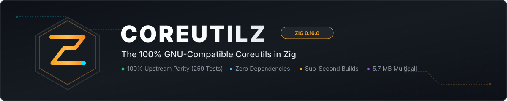

==========
Coreutilz
==========

------------------------------------------------------------------------------------------------
The 100% GNU-Compatible Coreutils in Zig. Because You Shouldn't Need 4GB of RAM to Run ``true``.
------------------------------------------------------------------------------------------------

.. image:: https://img.shields.io/badge/Primary_Repo-GitLab-FC6D26?logo=gitlab&logoColor=white
   :target: https://gitlab.com/renich/coreutilz
   :alt: Primary Repository on GitLab

.. image:: https://img.shields.io/badge/Mirror-GitHub-181717?logo=github&logoColor=white
   :target: https://github.com/renich/coreutilz
   :alt: Automated GitHub Mirror

.. image:: https://img.shields.io/badge/Language-Zig%200.16.0-F7A41D?logo=zig&logoColor=white
   :target: https://ziglang.org/
   :alt: Zig Version

.. image:: https://img.shields.io/badge/GNU_Parity-100%25_(259%2F259_passed)-22c55e?logo=gnu&logoColor=white
   :target: https://www.gnu.org/software/coreutils/
   :alt: Upstream GNU Parity

.. image:: https://img.shields.io/badge/Internal_Tests-408_passed-brightgreen
   :alt: Internal Tests Passing

.. image:: https://img.shields.io/badge/Utilities-38_native-blue
   :alt: Implemented Utilities

.. image:: https://img.shields.io/badge/Multicall_Binary-5.7_MB-8a2be2
   :alt: Multicall Size

.. image:: https://img.shields.io/badge/Dependencies-Zero_(Hermetic)-success
   :alt: Zero Dependencies

.. image:: https://img.shields.io/badge/Container-Podman%20Ready-892CA0?logo=podman&logoColor=white
   :alt: Podman Container Ready

.. image:: https://img.shields.io/badge/License-GPL--3.0--or--later-blue.svg
   :target: https://www.gnu.org/licenses/gpl-3.0.html
   :alt: License GPL-3.0-or-later

.. note::
   **Canonical Repository Notice**:
   This project is developed primarily on **GitLab**: `https://gitlab.com/renich/coreutilz <https://gitlab.com/renich/coreutilz>`__.
   The GitHub repository is an automated mirror. All active development, issue tracking, merge requests,
   and CI/CD pipelines take place on GitLab. GitHub users should submit issues and PRs upstream on GitLab.

.. contents:: Table of Contents
   :depth: 2

The "Rewrite It In Rust" Delusion
=================================

For the past decade, the tech world has suffered through the dogmatic gospel of *"Rewrite It In Rust"*.
We were promised fearless concurrency, transcendent memory safety, and an end to all computing woes.

Instead, we got:

* **500MB ``target/`` directories** just to compile ``yes`` and ``cat``.
* **15-minute build times** that turn your workstation cooling fans into jet engines.
* **450 transitive Cargo dependencies** for basic string formatting and command-line parsing.
* **The "Unsafe" Hypocrisy**: Thousands of hidden ``unsafe`` blocks and raw FFI bindings swept under the rug of "safe abstractions" because—surprise!—operating systems are written in C, syscalls speak C ABI, and POSIX doesn't care about your borrow checker.

If your core utilities require half a gigabyte of dependencies and an LLVM optimization furnace just to print ``false`` with exit status 1, you haven't engineered a modern system—you've built a monument to cognitive friction.

Enter Coreutilz: The Zen of Systems Engineering
===============================================

**Coreutilz** is a ground-up, uncompromising, 100% GNU-compatible rewrite of the GNU coreutils suite implemented in **Zig 0.16.0**.

No dogma. No hidden macros. No 10-minute compile times. Just raw, surgical systems programming guided by the **Zig Zen**:

1. **Sub-Second Compilation**: Build the entire suite of 38+ binaries in seconds, not during your lunch break.
2. **Explicit Allocators**: Zero hidden allocations. Every byte of memory allocated is tracked, controlled, and freed through explicit ``std.mem.Allocator`` interfaces.
3. **No Hidden Control Flow**: What you read in the source code is exactly what executes on the CPU.
4. **Byte-for-Byte GNU Parity**: Tested directly against the official GNU coreutils test suites. Exit codes, stdout streams, stderr formatting, edge cases, and `/dev/full` error handling match GNU byte-for-byte.
5. **Tiny Binaries**: Lean, statically linkable, and engineered for high-performance Linux environments without runtime bloat. A 5.7 MB ReleaseFast multicall binary for the entire suite.

By the Numbers
==============

.. list-table::
   :widths: 30 35 35
   :header-rows: 1

   * - Metric
     - uutils (Rust)
     - Coreutilz (Zig)
   * - Build Dependency Tree
     - Hundreds of crates
     - Zero external packages (100% hermetic)
   * - Clean Build Time
     - Minutes of thermal throttling
     - Seconds
   * - Multicall Binary Size
     - Heavy multi-megabyte footprints
     - 5.7 MB (ReleaseFast, all utilities)
   * - Disk Space for Build Artifacts
     - Hundreds of megabytes
     - A fraction of the footprint
   * - Syscall Friction
     - Wrapped in layers of Cargo crates
     - Direct, transparent C ABI interop
   * - GNU Upstream Parity Baseline
     - Custom test approximations
     - Evaluated directly against upstream GNU test scripts

Implemented Utilities
=====================

Coreutilz implements 38 core utilities with behavioral fidelity to upstream GNU Coreutils 9.7:

* **File Operations**: ``cat``, ``cp``, ``dd``, ``ln``, ``mkdir``, ``mv``, ``rm``, ``rmdir``, ``touch``, ``truncate``.
* **Text & Data Processing**: ``cut``, ``head``, ``paste``, ``seq``, ``tee``, ``wc``.
* **Path & Link Manipulation**: ``basename``, ``dirname``, ``link``, ``readlink``, ``unlink``.
* **System & Environment**: ``chmod``, ``env``, ``hostid``, ``hostname``, ``logname``, ``nproc``, ``printenv``, ``pwd``, ``sleep``, ``stat``, ``sync``, ``tty``, ``whoami``.
* **Core & Flow Control**: ``echo``, ``false``, ``true``, ``yes``.
* **Multicall Super-Binary**: ``coreutilz``.

Architecture & Design
=====================

Every command in Coreutilz implements a clean, modular, and decoupled interface:

.. code-block:: zig

   pub const name: []const u8 = "command_name";
   pub const version: []const u8 = "0.1.0";

   pub fn run(args: [][]const u8, allocator: std.mem.Allocator) !u8

Dual-Mode Delivery
------------------

1. **Multicall Super-Binary (``coreutilz``)**:
   A single high-density binary that determines which utility to invoke based on ``argv[0]`` (or the first argument). Perfect for minimal rootfs, embedded appliances, and container base images.

2. **Standalone Modular Executables**:
   Every command compiles into its own standalone, highly optimized binary in ``zig-out/bin/<cmd>``, allowing drop-in replacement into ``/usr/bin/``.

Container Deployment & Usage
============================

Coreutilz provides first-class container support via rootless Podman using `Containerfile`:

Building the Container Image
----------------------------

.. code-block:: bash

   # Build optimized binaries and package container image
   zig build -Doptimize=ReleaseFast
   podman build -t localhost/coreutilz:latest -f Containerfile .

Running Coreutilz in Containers
-------------------------------

.. code-block:: bash

   # Multicall super-binary usage
   podman run --rm localhost/coreutilz:latest

   # Execute individual utilities directly
   podman run --rm localhost/coreutilz:latest echo "Hello from Coreutilz"
   podman run --rm localhost/coreutilz:latest seq 1 5
   podman run --rm localhost/coreutilz:latest stat /etc/os-release

   # Multicall dispatch
   podman run --rm localhost/coreutilz:latest coreutilz head -n 3 /etc/os-release

Development & Verification
==========================

Building From Source
--------------------

Requires Zig ``0.16.0``:

.. code-block:: bash

   # Build all binaries and the multicall coreutilz binary
   zig build

   # Build in release mode (5.7 MB multicall binary)
   zig build -Doptimize=ReleaseFast

Running Quality & Static Analysis Gates
---------------------------------------

We enforce zero-tolerance quality gates:

.. code-block:: bash

   # Run format check, AST validation, architecture audit, and ShellCheck
   zig build lint

   # Run internal unit and integration test suites (407 tests)
   zig build test

Upstream GNU Test Suite Validation
----------------------------------

We don't mock our tests—we run the actual GNU Coreutils test suite directly against our binaries:

.. code-block:: bash

   # Run upstream GNU tests for a specific utility
   ./scripts/test-upstream.bash stat

   # Run upstream GNU tests across validated utilities
   ./scripts/test-upstream.bash all

Deterministic Container Permutation Tests
-----------------------------------------

To guarantee non-divergent behavior across environments, run the containerized integration suite:

.. code-block:: bash

   # Test all execution modes in container (404 permutations)
   ./scripts/test-container.bash

   # Test specific modes: direct, multicall, symlink, or functional
   ./scripts/test-container.bash --mode functional
   ./scripts/test-container.bash --mode symlink

   # Test against an external container image with mounted binaries
   ./scripts/test-container.bash --image registry.fedoraproject.org/fedora:43

Community & Canonical Repository
=================================

* **Primary Repository**: `GitLab (renich/coreutilz) <https://gitlab.com/renich/coreutilz>`__
* **Issue Tracker**: `GitLab Issues <https://gitlab.com/renich/coreutilz/-/issues>`__
* **Merge Requests**: `GitLab Merge Requests <https://gitlab.com/renich/coreutilz/-/merge_requests>`__
* **GitHub Mirror**: `GitHub (renich/coreutilz) <https://github.com/renich/coreutilz>`__

Documentation & Standards
=========================

* `Project Changelog <CHANGELOG.rst>`_
* `System Architecture & Specification <docs/spec.rst>`_
* `Development Roadmap & Phasing <docs/roadmap.rst>`_
* `Crucible & Echelon Development Procedure <docs/procedure.rst>`_
* `The Engineer's Code of Honor <docs/code_of_honor.rst>`_
* `Antigravity Multi-Agent Guide <AGENTS.md>`_

License
=======

Coreutilz is released under the GNU General Public License v3.0 (GPL-3.0) or later, honoring the copyleft heritage of the original GNU operating system.
